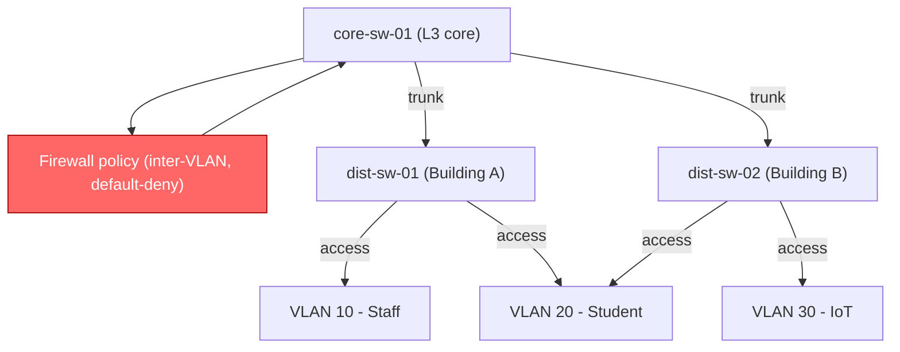
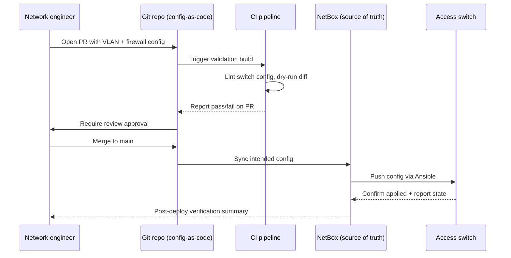
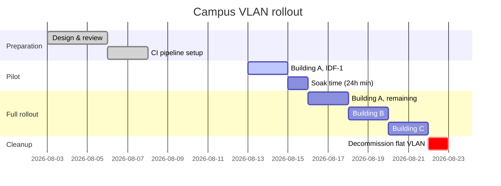

# Showcase: rolling out a campus VLAN change

This page is a formatting reference, not real course content: it walks through
a fictional but realistic change — segmenting a campus network into VLANs and
pushing the new switch configuration through a small GitOps pipeline — purely
to demonstrate the full range of Markdown formatting available on this site.

!!! abstract "Summary"
    We segment a flat campus LAN into three VLANs (staff, students, IoT),
    push the change through a Git-reviewed CI pipeline onto the access
    switches, and verify it with a post-deploy check. Along the way this
    page exercises admonitions, task lists, Mermaid diagrams, content tabs,
    highlighted code, tables, and inline formatting.

## The scenario

The network currently has every device — staff laptops, student devices, and
IoT sensors — on a single untagged VLAN. That's simple but insecure: a
compromised IoT camera can talk directly to staff file shares. The plan is to
split traffic into three VLANs enforced at the access layer, with a firewall
policy that only allows the traffic each group actually needs.

## Notes on the change

!!! note "Addressing plan"
    Staff gets `VLAN 10` (`10.0.10.0/24`), students get `VLAN 20`
    (`10.0.20.0/24`), and IoT devices get `VLAN 30` (`10.0.30.0/24`). The
    router-on-a-stick sub-interfaces already exist on `core-sw-01`.

!!! tip "Test on one closet first"
    Before touching every access switch, apply the change to a single wiring
    closet and leave it running for a full business day. Most VLAN mistakes
    (wrong native VLAN, missing trunk allowed-list) show up within hours.

!!! warning "Trunk allowed-VLAN lists"
    If you forget to add the new VLANs to the trunk's allowed list on every
    intermediate switch, traffic will silently blackhole on just the segments
    you missed — it won't fail loudly, so check `show interface trunk` on
    each hop.

!!! danger "Don't prune VLAN 1 on the uplink to the core"
    Removing VLAN 1 from a trunk that still carries management traffic can
    lock you out of the switch remotely. Always keep an out-of-band console
    path available while making trunk changes.

!!! example "Sample port assignment"
    Access port `Gi1/0/12` on `dist-sw-04` moves from the flat network to
    `VLAN 20` (students) with `switchport access vlan 20` and
    `spanning-tree portfast`.

!!! quote "From the change request"
    "IoT devices must not be able to initiate connections to staff or
    student VLANs under any circumstances — inbound-only from those
    segments, if that." — security review comment on CR-4471

??? note "Collapsible: full VLAN allocation table"
    | VLAN ID | Name    | Subnet          | Gateway      |
    |--------:|---------|-----------------|--------------|
    | 10      | STAFF   | 10.0.10.0/24    | 10.0.10.1    |
    | 20      | STUDENT | 10.0.20.0/24    | 10.0.20.1    |
    | 30      | IOT     | 10.0.30.0/24    | 10.0.30.1    |
    | 99      | MGMT    | 10.0.99.0/24    | 10.0.99.1    |

## Key highlights

- Three new VLANs, enforced at the access layer on every wiring closet switch.
- A firewall policy on `core-sw-01` that defaults to deny between VLANs.
- A CI pipeline that validates switch configs before anything is pushed.
- A phased rollout, one wiring closet at a time, with a rollback plan.

Rollout checklist so far:

- [x] Design VLAN and addressing plan
- [x] Write and review firewall policy (default-deny inter-VLAN)
- [x] Validate configs in CI against a switch config linter
- [ ] Roll out to pilot closet (Building A, IDF-1)
- [ ] Roll out to remaining closets
- [ ] Decommission the old flat VLAN

## Visualizing the rollout

Three views of the same change: what the network looks like, how the change
request actually flows through review and deployment, and when each building
gets touched.

### Target topology



### Change request flow



### Rollout schedule



## Deploying the configuration

The same push can be triggered a few different ways depending on where you
are — locally with a script, from the CI job, or declaratively via the
Ansible playbook that CI ultimately calls.

=== "Bash"

    ```bash
    # Push the validated config to a single access switch
    ansible-playbook deploy_vlan.yml \
      --limit dist-sw-01 \
      --extra-vars "vlan_file=vlans/building-a.yml"
    ```

=== "Python"

    ```python
    from netmiko import ConnectHandler

    switch = ConnectHandler(
        device_type="cisco_ios",
        host="dist-sw-01.campus.local",
        username="automation",
        use_keys=True,
    )
    output = switch.send_config_set([
        "vlan 20",
        " name STUDENT",
        "interface range Gi1/0/1-24",
        " switchport access vlan 20",
    ])
    print(output)
    ```

=== "YAML"

    ```yaml
    # vlans/building-a.yml
    switch: dist-sw-01
    vlans:
      - id: 10
        name: STAFF
        ports: [Gi1/0/1-8]
      - id: 20
        name: STUDENT
        ports: [Gi1/0/9-24]
    ```

## Validating a switch config

CI runs every proposed config through a small linter before it's allowed to
merge. `line 2` and `line 5` below are the checks that catch the two mistakes
that actually happened during testing: a missing allowed-VLAN entry and a
stray access port left in the default VLAN.

```python title="validate_vlan.py" hl_lines="2 5"
def validate(config: SwitchConfig) -> list[str]:
    errors = []
    if not config.trunk_allows(NEW_VLAN_IDS):
        errors.append("trunk allowed-vlan list is missing new VLANs")
    if config.has_ports_in_default_vlan():
        errors.append("access ports still assigned to VLAN 1")
    if not config.has_default_deny_acl():
        errors.append("inter-VLAN firewall policy is missing")
    return errors
```

## Comparing rollout strategies

Three ways this change could have been rolled out, and why we picked phased.

| Strategy   | Downtime risk | Rollback speed | Complexity |
|:-----------|:-------------:|----------------:|:-----------|
| Big bang   | High          | Slow            | Low        |
| Phased     | Low           | Fast            | Medium     |
| Canary     | Very low      | Fast            | High       |

## A note on formatting

This paragraph exists purely to show inline styles: a config value can be
==highlighted== for emphasis, a later ^^insert^^ can show wording added
during review, and a ~~previous, now wrong~~ subnet can be struck through.
Command names and file paths use `inline code`, like `show vlan brief`. The
pilot rollout is scheduled to start today[^1] :rocket:, and if it goes
sideways there's a documented rollback :warning:.

## Summary

- Segmenting the campus LAN into staff/student/IoT VLANs, enforced at the
  access layer with a default-deny inter-VLAN firewall policy, meaningfully
  reduces blast radius from a compromised device.
- Config-as-code plus CI validation catches the two most common VLAN
  mistakes — missing trunk allowed-lists and stray default-VLAN ports —
  before they ever reach a switch.
- A phased, one-closet-at-a-time rollout with a soak period keeps risk low
  without the complexity of a full canary setup.

[^1]: Relative to whenever this showcase page was last built — it's dummy
    content, not an actual maintenance window.
