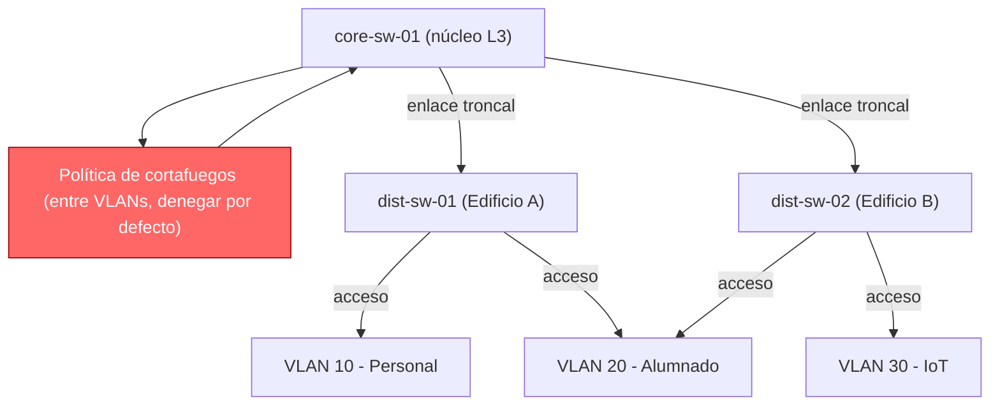
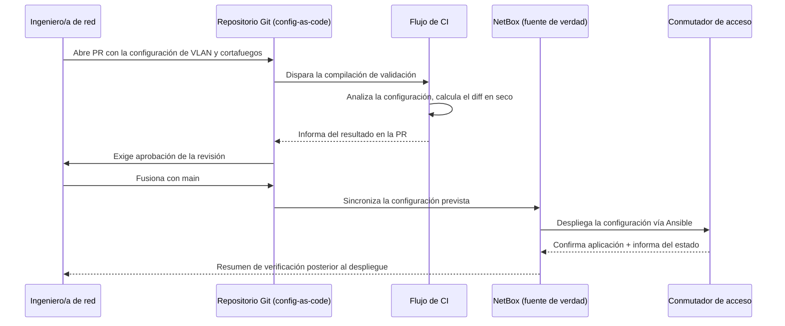
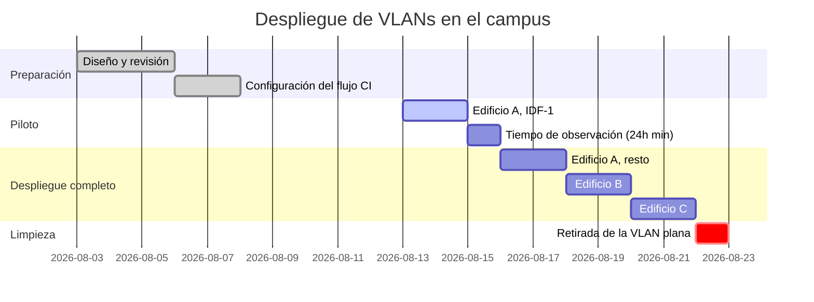

# Muestra: despliegue de un cambio de VLAN en el campus

Esta página es una referencia de formato, no contenido real del curso: recorre
un cambio ficticio pero realista — segmentar la red del campus en VLANs y
desplegar la nueva configuración de los conmutadores mediante un pequeño flujo
GitOps — con el único fin de mostrar todo el abanico de formato Markdown
disponible en este sitio.

!!! abstract "Resumen"
    Segmentamos una LAN de campus plana en tres VLANs (personal, alumnado,
    IoT), desplegamos el cambio mediante un flujo de CI con revisión en Git
    sobre los conmutadores de acceso, y lo verificamos con una comprobación
    posterior al despliegue. Por el camino, esta página ejercita
    admoniciones, listas de tareas, diagramas Mermaid, pestañas de
    contenido, código resaltado, tablas y formato en línea.

## El escenario

Actualmente la red tiene todos los dispositivos — portátiles del personal,
dispositivos del alumnado y sensores IoT — en una única VLAN sin etiquetar.
Eso es sencillo pero inseguro: una cámara IoT comprometida puede hablar
directamente con los recursos compartidos del personal. El plan es dividir el
tráfico en tres VLANs aplicadas en la capa de acceso, con una política de
cortafuegos que solo permita el tráfico que cada grupo necesita realmente.

## Notas sobre el cambio

!!! note "Plan de direccionamiento"
    El personal recibe la `VLAN 10` (`10.0.10.0/24`), el alumnado la
    `VLAN 20` (`10.0.20.0/24`) y los dispositivos IoT la `VLAN 30`
    (`10.0.30.0/24`). Las subinterfaces router-on-a-stick ya existen en
    `core-sw-01`.

!!! tip "Prueba primero en un solo armario"
    Antes de tocar todos los conmutadores de acceso, aplica el cambio en un
    único armario de cableado y déjalo funcionando un día laborable
    completo. La mayoría de errores de VLAN (VLAN nativa incorrecta, lista
    de permitidas del enlace troncal incompleta) aparecen en pocas horas.

!!! warning "Listas de VLANs permitidas en el enlace troncal"
    Si olvidas añadir las nuevas VLANs a la lista de permitidas del enlace
    troncal en cada conmutador intermedio, el tráfico se perderá en
    silencio solo en los tramos que hayas olvidado — no fallará de forma
    ruidosa, así que revisa `show interface trunk` en cada salto.

!!! danger "No elimines la VLAN 1 del enlace ascendente hacia el núcleo"
    Eliminar la VLAN 1 de un enlace troncal que todavía transporta tráfico
    de gestión puede dejarte sin acceso remoto al conmutador. Mantén
    siempre una vía de consola fuera de banda disponible mientras se
    realizan cambios en los enlaces troncales.

!!! example "Ejemplo de asignación de puerto"
    El puerto de acceso `Gi1/0/12` en `dist-sw-04` pasa de la red plana a
    la `VLAN 20` (alumnado) con `switchport access vlan 20` y
    `spanning-tree portfast`.

!!! quote "De la solicitud de cambio"
    «Los dispositivos IoT no deben poder iniciar conexiones hacia las
    VLANs del personal o del alumnado bajo ninguna circunstancia — como
    mucho, tráfico entrante desde esos segmentos». — comentario de la
    revisión de seguridad en CR-4471

??? note "Desplegable: tabla completa de asignación de VLANs"
    | VLAN ID | Nombre  | Subred          | Puerta de enlace |
    |--------:|---------|-----------------|-------------------|
    | 10      | STAFF   | 10.0.10.0/24    | 10.0.10.1         |
    | 20      | STUDENT | 10.0.20.0/24    | 10.0.20.1         |
    | 30      | IOT     | 10.0.30.0/24    | 10.0.30.1         |
    | 99      | MGMT    | 10.0.99.0/24    | 10.0.99.1         |

## Aspectos clave

- Tres VLANs nuevas, aplicadas en la capa de acceso en cada armario de
  cableado.
- Una política de cortafuegos en `core-sw-01` que deniega por defecto entre
  VLANs.
- Un flujo de CI que valida la configuración de los conmutadores antes de
  desplegar nada.
- Un despliegue por fases, un armario de cableado cada vez, con un plan de
  reversión.

Lista de comprobación del despliegue hasta ahora:

- [x] Diseñar el plan de VLANs y direccionamiento
- [x] Escribir y revisar la política de cortafuegos (denegar por defecto
      entre VLANs)
- [x] Validar las configuraciones en CI con un analizador de configuración
      de conmutadores
- [ ] Desplegar en el armario piloto (Edificio A, IDF-1)
- [ ] Desplegar en el resto de armarios
- [ ] Retirar la VLAN plana antigua

## Visualizando el despliegue

Tres vistas del mismo cambio: cómo queda la red, cómo fluye realmente la
solicitud de cambio a través de la revisión y el despliegue, y cuándo se
interviene en cada edificio.

### Topología objetivo



### Flujo de la solicitud de cambio



### Calendario del despliegue



## Despliegue de la configuración

El mismo cambio se puede desencadenar de varias formas según dónde estés —
localmente con un script, desde el propio job de CI, o de forma declarativa
mediante el playbook de Ansible que CI acaba invocando.

=== "Bash"

    ```bash
    # Despliega la configuración validada en un único conmutador de acceso
    ansible-playbook deploy_vlan.yml \
      --limit dist-sw-01 \
      --extra-vars "vlan_file=vlans/building-a.yml"
    ```

=== "Python"

    ```python
    from netmiko import ConnectHandler

    switch = ConnectHandler(
        device_type="cisco_ios",
        host="dist-sw-01.campus.local",
        username="automation",
        use_keys=True,
    )
    output = switch.send_config_set([
        "vlan 20",
        " name STUDENT",
        "interface range Gi1/0/1-24",
        " switchport access vlan 20",
    ])
    print(output)
    ```

=== "YAML"

    ```yaml
    # vlans/building-a.yml
    switch: dist-sw-01
    vlans:
      - id: 10
        name: STAFF
        ports: [Gi1/0/1-8]
      - id: 20
        name: STUDENT
        ports: [Gi1/0/9-24]
    ```

## Validación de la configuración de un conmutador

CI pasa cada configuración propuesta por un pequeño analizador antes de
permitir la fusión. Las líneas `2` y `5` de abajo son las comprobaciones que
detectan los dos errores que ocurrieron realmente durante las pruebas: una
entrada de VLAN permitida ausente en el enlace troncal y un puerto de acceso
olvidado en la VLAN por defecto.

```python title="validate_vlan.py" hl_lines="2 5"
def validate(config: SwitchConfig) -> list[str]:
    errors = []
    if not config.trunk_allows(NEW_VLAN_IDS):
        errors.append("trunk allowed-vlan list is missing new VLANs")
    if config.has_ports_in_default_vlan():
        errors.append("access ports still assigned to VLAN 1")
    if not config.has_default_deny_acl():
        errors.append("inter-VLAN firewall policy is missing")
    return errors
```

## Comparación de estrategias de despliegue

Tres formas en las que se podría haber desplegado este cambio, y por qué
elegimos la opción por fases.

| Estrategia    | Riesgo de inactividad | Velocidad de reversión | Complejidad |
|:--------------|:----------------------:|-------------------------:|:-------------|
| Todo de una vez | Alto                  | Lenta                    | Baja         |
| Por fases       | Bajo                  | Rápida                   | Media        |
| Canario         | Muy bajo              | Rápida                   | Alta         |

## Una nota sobre el formato

Este párrafo existe solo para mostrar estilos en línea: un valor de
configuración se puede ==resaltar== para dar énfasis, una ^^inserción^^
posterior puede mostrar el texto añadido durante la revisión, y una subred
~~anterior, ahora incorrecta~~ se puede tachar. Los nombres de comandos y
rutas de archivo usan `código en línea`, como `show vlan brief`. El
despliegue piloto está previsto que empiece hoy[^1] :rocket:, y si algo sale
mal existe un plan de reversión documentado :warning:.

## Resumen

- Segmentar la LAN del campus en VLANs de personal, alumnado e IoT,
  aplicadas en la capa de acceso con una política de cortafuegos entre
  VLANs que deniega por defecto, reduce de forma significativa el radio de
  impacto de un dispositivo comprometido.
- La configuración como código junto con la validación en CI detecta los
  dos errores de VLAN más habituales — listas de permitidas del enlace
  troncal incompletas y puertos olvidados en la VLAN por defecto — antes
  de que lleguen a un conmutador.
- Un despliegue por fases, un armario de cableado cada vez, con un periodo
  de observación, mantiene el riesgo bajo sin la complejidad de un
  despliegue canario completo.

[^1]: En relación con el momento en que se generó por última vez esta
    página de muestra — es contenido ficticio, no una ventana de
    mantenimiento real.
